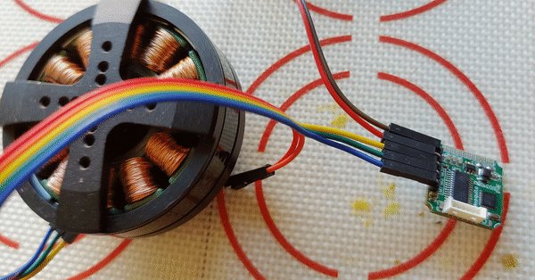
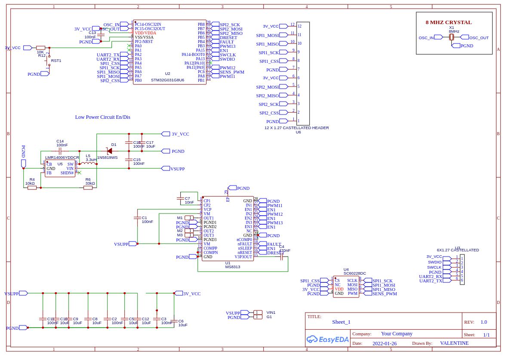
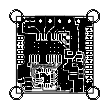

SIMPLEFOC_BLDC_MOSQUITO_V20
===

| |
|---|
|  |

Copied from VALENTINE's project on [OSHWLab](https://oshwlab.com/cost.co/20220126_bldc_mosquito_copy).

Profile：Fully integrated G031 with DRV8313, size 20mm x 20mm, capable of running SimpleFOC

License: CERN Open Hardware License

Project source: Cloned from 20220126_BLDC_MOSQUITO

Description
---

Fully integrated G031 with DRV8313, size 20mm x 20mm, capable of running SimpleFOC. Contains a proper step-down buck converter and an angle sensor on the back connected to SPI2 on that chip. End result is a 20x20mm, 2A max, 8 to 24V SimpleFOC BLDC driver with an integrated SPI / 20k RPM angle sensor on the back.

Design Drawing
---

| |
|---|
|  |

PCB
---

| |
|---|
|  |

BOM
---

[bom](BOM_SIMPLEFOC_BLDC_MOSQUITO_V20_2022-11-24.csv)

License
---

CERN Open Hardware License

